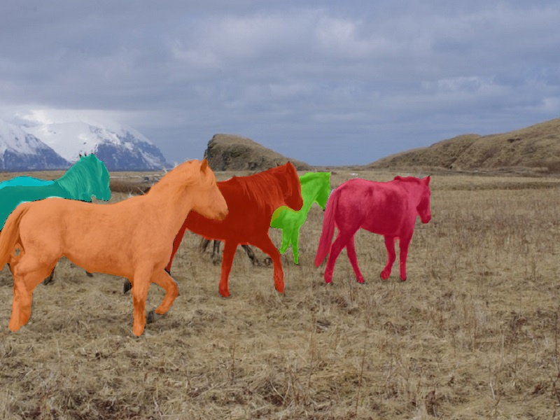

# Mask2Former-ncnn  

```
mkdir build
cd build 
cmake ..
make 
./mask2former_ncnn ../imgs/horses.jpg
```
## screenshot


## reference  
https://github.com/Tencent/ncnn  
https://github.com/facebookresearch/Mask2Former  
https://github.com/pytorch/vision  
